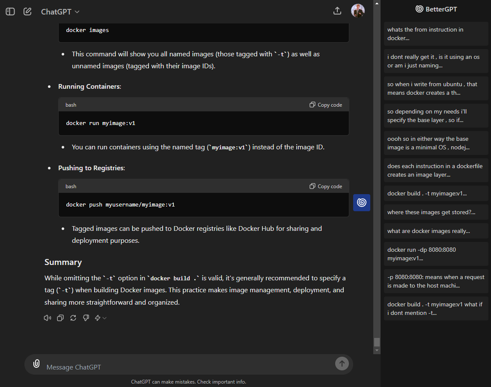

 ## BetterGPT (WiP)

- ⚠️I will be reworking the following:
  - Migrate to [wxt](https://wxt.dev/), I was using [crxjs.dev](https://crxjs.dev/vite-plugin).
  - Rework the way of selecting the dom , previously I was depending on MutationObserver which i find not good for performance and it's kinda tricky. Now I'll be relying on [chrome.webRequest](https://developer.chrome.com/docs/extensions/reference/api/webRequest) API as an event to select the dom whenever a request response is returned.
 
- Feel free to contribute. 

- BetterGPT is a chrome extension that aims to add quality of life features to chatGPT.

- The main one is the message list of current chat to scroll fast between messages without doing it manually.

- Other features are planned : Bookmarking messages & chats , maybe support for other chatbots like claude , gemini ...

## Progress & features

- 🔸🔶 Load messages partially added
  > ( still have to load when other events occur , eg: when a message is sent ).
- ✔️ Scroll into message added.

## Run the project 

- Run the the command `npm install` to download & install the dependencies .
- Run the the command `npm run build` , 
	> it will run generate the build which is `chrome-mv3` in the `.output` folder. 
- Open Chrome or Edge and navigate to `chrome://extensions`. Make sure to turn on the developer mode switch.
	<table>
	<tr>
		<th>Chrome top right</th>
		<th>Edge on the right sidebar</th>
	</tr>
	<tr>
		<td></td>
		<td></td>
	</tr>
	</table>

- Drag the`chrome-mv3` folder into the Extensions Dashboard to install it or click load unpacked And done! You can see the messages on the togglable sidebar **(Scroll to chat message feature is still WiP)**
- 
