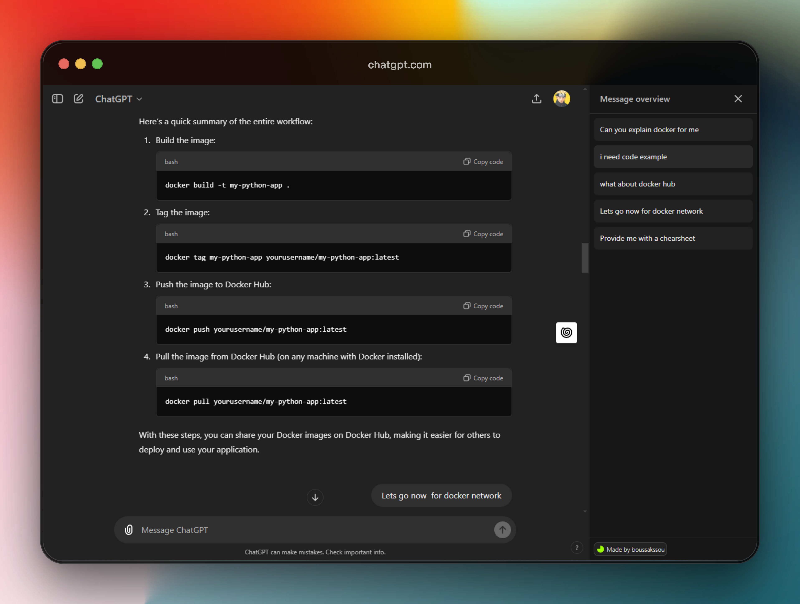

  
  <h1>BetterGPT</h1>
  
A Chrome extension that enhances ChatGPT's UX

  

## NOTE : I unpublished the extension from the Chrome web store, to find out why, check out this [Issue](https://github.com/COUSCOUSZ/BetterGPT/issues/5)

- Feel free to contribute. 

- BetterGPT is a chrome extension that aims to UX features to chatGPT.

- I'm using [wxt](https://wxt.dev/) library.

# Features

- 📜 Message List: Quick navigation through chat messages without manual scrolling
- 🎯 Instant Scroll: Jump to any message with a single click
- 🔃 Scroll indicator (In progress).
- Other features are planned : Bookmarking messages & chats , support for other chatbots like deepseek

# Contributing
For guidelines on how to contribute, please refer to [CONTRIBUTE.md](contribute.md).

# Supported websites 
- ChatGPT
- Claude 
- Gemini

